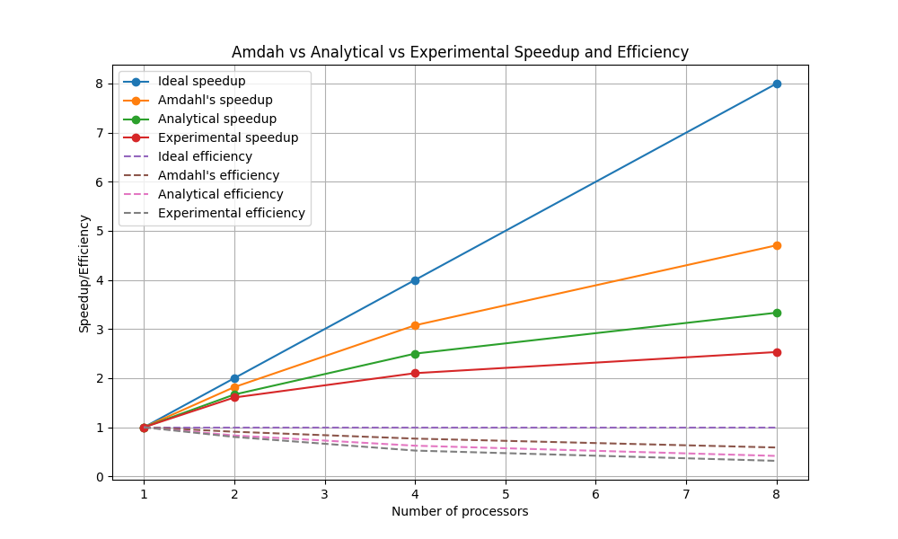

# Parallel Quick Sort

Use C language with MPI and OpenMP Library to build a parallel quick sort.

## Performance Analysis

Analyze performance of your parallel application, using Amdahl’s model and analytical model.

## Graphs

Draw the Speed-up and Efficiency graph: must show an ideal line, Amdahl’s line, analytical line, and experimental runtime line with 1, 2, 4, 8 number of processors (cores/ranks).

## Computer System Architecture

Detail and draw diagram for computer system architecture of the experiment.

- Processor
  - Apple silicon M1
- Memory
  - 8GB
- Storage
  - 256GB
- Operating System
  - MacOS Sonoma 14.3.1 (23D60)
